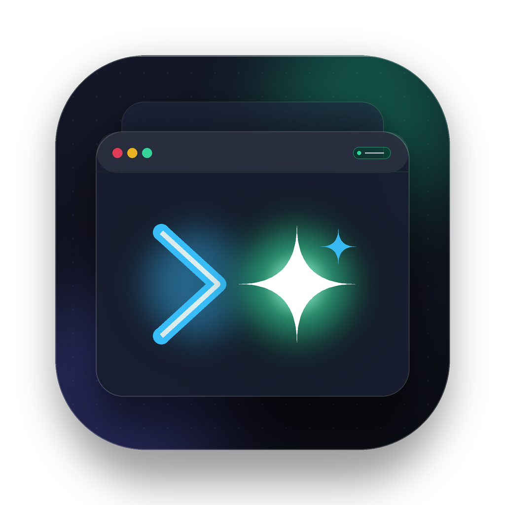

# AgentFloat

<p align="center">
  
  <br />
  <b>专注于 AI Coding Agent 轮次结束与任务追踪的 macOS 桌面置顶悬浮提醒器</b>
  <br />
  <i>零外部第三方依赖 · 原生 Swift 6 & SwiftUI · 纯本地 127.0.0.1 环回通信 · 严禁将任务结束等同于代码验证通过</i>
</p>

<p align="center">
  
  
  
  
</p>

---

## 💡 核心设计哲学

> ⚠️ **核心准则：严禁将任务结束等同于代码验证通过！**
> 
> 在大模型自主编码（Agentic Coding）的流程中，Agent 进程的“执行结束”或“生成完毕”，**仅仅代表当前轮次推理完毕，绝对不等于代码逻辑正确或通过人工验证**。
> 
> AgentFloat 专门在视觉交互上注入警示：所有完成卡片均醒目标注 **“任务结束 · 请人工验证代码”**，并通过一键「查看终端」和「已处理」交互闭环，促使开发者始终保持审慎的代码核查习惯。

---

## ✨ 核心特性

- 🪶 **极致轻量，零第三方依赖**：
  全部基于 macOS 系统内置系统框架开发（`Foundation`、`SwiftUI`、`AppKit`、`SQLite3`、`Network.framework`），代码干净透明，无任何外部 NPM / CocoaPods / SPM 依赖包袱。
- 🖥 **全空间置顶悬浮窗 (`FloatingPanel`)**：
  采用系统级 `NSPanel`，配置 `.floating` 级别并支持全屏与多空间穿梭（`canJoinAllSpaces`, `fullScreenAuxiliary`）。作为非激活窗口（`.nonactivatingPanel`），**绝不抢占开发者正在打字输入的终端焦点**。
- 🔔 **清晰直观的视觉反馈**：
  - 🟢 **绿色高亮**：任务正常完成（醒目提示：*任务结束 · 请人工验证代码*）
  - 🔴 **红色高亮**：任务异常报错或被用户中止（醒目提示：*任务异常 · 请检查错误日志*）
  - 🟡 **黄色高亮**：状态未知
- 🎯 **一键聚焦终端 (`TerminalLauncher`)**：
  卡片提供「查看终端」按钮，智能检测并支持唤起 **Otty** (`io.appmakes.otty`)、**Ghostty** (`com.mitchellh.ghostty`)、**Apple Terminal** (`com.apple.Terminal`) 以及 **iTerm2** (`com.googlecode.iterm2`)，并自动 `cd` 定位至项目工作目录。
- 🛡 **安全本地环回机制**：
  HTTP 服务基于 `Network.framework` 强绑定 `127.0.0.1` 环回接口，拒绝外部网络监听。开机自动生成 32 字节高强度鉴权 Token，保存在 `~/.agentfloat/auth_token` 并应用严格的 POSIX `0600` 权限保护。
- 🗄 **高并发安全存储 (`SQLiteTaskStore`)**：
  原生 SQLite3 C API actor 封装，启用 WAL 模式与唯一去重索引 `(source, session_id, turn_id)`，天然防御 Webhook 重复推送或重试产生的通知风暴。
- 🧩 **全生态接入**：
  原生集成 **Pi Extension**、**Codex CLI Hook**，以及功能完备的 `agentfloat` 命令行工具。

---

## 🏛 架构设计

```
AgentFloat
├── AgentFloatCore (核心底层库)
│   ├── Models/AgentTask.swift          # 任务实体与状态模型
│   ├── Storage/SQLiteTaskStore.swift   # 原生 SQLite3 C API actor，WAL 事务与去重
│   ├── Network/AuthTokenManager.swift  # 0600 本地安全 Token 管理
│   ├── Network/LocalHttpServer.swift   # Network.framework NWListener 127.0.0.1 HTTP 服务
│   ├── Integrations/TerminalLauncher.swift # Otty / Ghostty / Terminal / iTerm2 唤起与导航
│   └── Engine/TaskManager.swift        # 核心协调器与人工核验状态分发
│
├── AgentFloatApp (macOS 常驻桌面应用)
│   ├── App/AppDelegate.swift           # NSApp accessory 策略与状态项管理
│   ├── Windows/FloatingPanel.swift     # 屏幕右上角置顶悬浮 Panel
│   ├── Views/FloatingCardView.swift    # 悬浮通知卡片 UI 与交互
│   └── Views/MenuBarView.swift         # 菜单栏 Popover 任务与历史管理
│
├── AgentFloatCLI (命令行工具)
│   └── main.swift                      # 调试、事件发送、任务列表与处理
│
├── extensions/pi/                      # Pi Agent 官方扩展
└── scripts/codex-notify.sh             # Codex CLI 通知适配脚本
```

---

## 🚀 安装与构建

### 系统要求
- macOS 15.0 (Sequoia) 或更高版本
- Swift 6.0+（从源码编译时需要）

### 方式一：通过 Homebrew 一键安装 (推荐)

```bash
brew install --cask life2you/tap/agentfloat
```
> 💡 通过 Homebrew Cask 安装后，系统会自动将 `AgentFloat.app` 放入应用程序目录，并在终端注册全局 `agentfloat` 命令行工具。

### 方式二：从源码编译与打包

```bash
# 克隆仓库
cd path/to/AgentFloat

# 调试模式编译全部 Target
make build

# 运行单元测试
make test

# 一键打包 macOS App Bundle
make app
```
打包完成后产物位于 `build/AgentFloat.app`，直接打开即可：
```bash
open build/AgentFloat.app
```

### 安装全局 CLI 工具 (若从源码编译)

```bash
make install-cli
# 默认安装至 /usr/local/bin/agentfloat
```

---

## 🛠 CLI 工具使用手册

`agentfloat` 提供了灵活的命令行能力，支持在任何终端脚本或任务钩子中调用：

```bash
# 1. 发送测试卡片 (模拟成功任务，展现绿色卡片)
agentfloat test --success

# 2. 发送测试卡片 (模拟报错任务，展现红色卡片)
agentfloat test --error

# 3. 发送自定义任务事件
agentfloat emit \
  --source pi \
  --status completed \
  --title "实现用户鉴权模块" \
  --cwd "$(pwd)" \
  --summary "已生成 AuthController.swift 并通过测试"

# 4. 查看待处理任务列表
agentfloat list

# 5. 查看全部任务（含历史记录）
agentfloat list --all

# 6. 标记指定任务为已处理
agentfloat resolve <task-id>

# 7. 查看本地鉴权 Token
agentfloat token

# 8. 检查本地服务健康状态
agentfloat health
```

---

## 🔌 生态集成与配置

### 1. Pi Agent 扩展配置 (`extensions/pi`)

AgentFloat 为 Pi Agent 提供了原生 TypeScript 扩展，能够自动监听生命周期事件（`agent_start`, `turn_end`, `agent_settled`）并推送给 AgentFloat。

在 Pi 的插件/扩展目录引入该扩展：
```typescript
import extension, { activate } from './extensions/pi';

export default extension;
export { activate };
```
扩展将自动读取 `~/.agentfloat/auth_token` 并将事件推送到 `http://127.0.0.1:41920/api/events`。

### 2. Codex (CLI & 桌面版) 配置 (`scripts/codex-notify.sh`)

Codex CLI 与官方 Codex 桌面版（基于 `ChatGPT.app` / `codex app-server`）均支持在轮次完成后触发通知脚本。将 `scripts/codex-notify.sh` 配置到 Codex 中：

在 `~/.codex/config.toml` 中配置（推荐）：
```toml
notify = ["/path/to/AgentFloat/scripts/codex-notify.sh", "turn-ended"]
```

或在 `~/.codex/config.json` 中配置：
```json
{
  "notify": "/path/to/AgentFloat/scripts/codex-notify.sh"
}
```

也可以在 Codex CLI 启动参数中指定：
```bash
codex --notify /path/to/AgentFloat/scripts/codex-notify.sh
```

> 💡 **桌面版兼容说明**：脚本内置透明链式转发，会自动保持与系统 `SkyComputerUseClient` 等下游客户端的透传，绝不破坏 Codex 桌面版内部通信；同时支持卡片一键聚焦置顶 Codex 桌面端与终端窗口。

测试 Codex 通知脚本：
```bash
./scripts/codex-notify.sh '{"thread-id":"th-1","turn-id":"tu-1","cwd":"/path/to/project","last-assistant-message":"Refactoring completed","status":"completed"}'
```

---

## 📡 HTTP API 规范

本地服务监听于 `http://127.0.0.1:41920`。所有 `/api/events`、`/api/codex/notify`、`/api/tasks` 端点均需携带鉴权 Token：
- Header 格式：`Authorization: Bearer <TOKEN>` 或 `X-AgentFloat-Token: <TOKEN>`

| 方法 | 路径 | 说明 |
| :--- | :--- | :--- |
| `GET` | `/api/health` | 健康检查（免鉴权） |
| `POST` | `/api/events` | 发送通用任务事件 |
| `POST` | `/api/codex/notify` | Codex CLI 专用通知接收 |
| `POST` | `/api/test/emit` | 发送测试模拟卡片 |
| `GET` | `/api/tasks` | 获取任务列表（支持 `?filter=pending` 或 `?filter=all`） |
| `POST` | `/api/tasks/{id}/resolve` | 标记任务为已处理 |
| `POST` | `/api/tasks/{id}/dismiss` | 隐藏卡片（不标记已处理） |

---

## 💻 终端适配 (`TerminalLauncher`)

AgentFloat 原生支持以下四款主流 macOS 终端，点击卡片中的 **「查看终端」** 即可呼出：

1. **Otty** (`io.appmakes.otty`)
2. **Ghostty** (`com.mitchellh.ghostty`)
3. **Apple Terminal** (`com.apple.Terminal`)
4. **iTerm2** (`com.googlecode.iterm2`)

**激活逻辑**：
- 若事件载荷指定了 `terminalApp`，优先激活该终端；
- 若未指定，自动检测当前正在运行的终端应用；
- 若未运行，自动回退到默认终端或 Terminal.app；
- 支持自动将终端会话工作目录切换（`cd`）到任务的 `cwd` 目录。

---

## ❓ 常见问题 (FAQ)

**Q: 为什么 Agent 提示完成之后，卡片依然提示“请人工验证代码”？**
> **A:** 这正是 AgentFloat 的核心初衷。现代 AI Coding Agent 经常会出现幻觉、缺少边界用例测试或代码逻辑疏漏。完成状态表示机器工作暂停，请务必人工审阅 Diff、运行单元测试后再点击「已处理」。

**Q: 悬浮窗会打断我在 IDE / 终端里的键盘输入吗？**
> **A:** 绝不会。悬浮窗基于 `NSPanel` 设置了 `.nonactivatingPanel` 样式，在显示时不会夺取系统 Key Window 焦点，你可以继续流畅敲击键盘。

**Q: 点击右上角 `X` 和点击「已处理」有什么区别？**
> **A:**
> - 点击 `X`（关闭）：仅关闭当前置顶卡片，任务仍然保留在待处理列表中（菜单栏图标仍会计数），方便你稍后处理。
> - 点击「已处理」：确认已经过人工代码检验，任务归入历史记录。

**Q: 可以在内网其他机器推送事件到我的 AgentFloat 吗？**
> **A:** 默认不支持。出于极致的安全性考虑，服务使用系统底层 `NWParameters.requiredInterfaceType = .loopback` 严格限制在 `127.0.0.1` 环回接口，任何外部网络流量均会被操作系统直接拒绝。

---

## 📄 开源许可证

本项目基于 [MIT License](LICENSE) 开源发布。
Copyright (c) 2026 AgentFloat Contributors.
